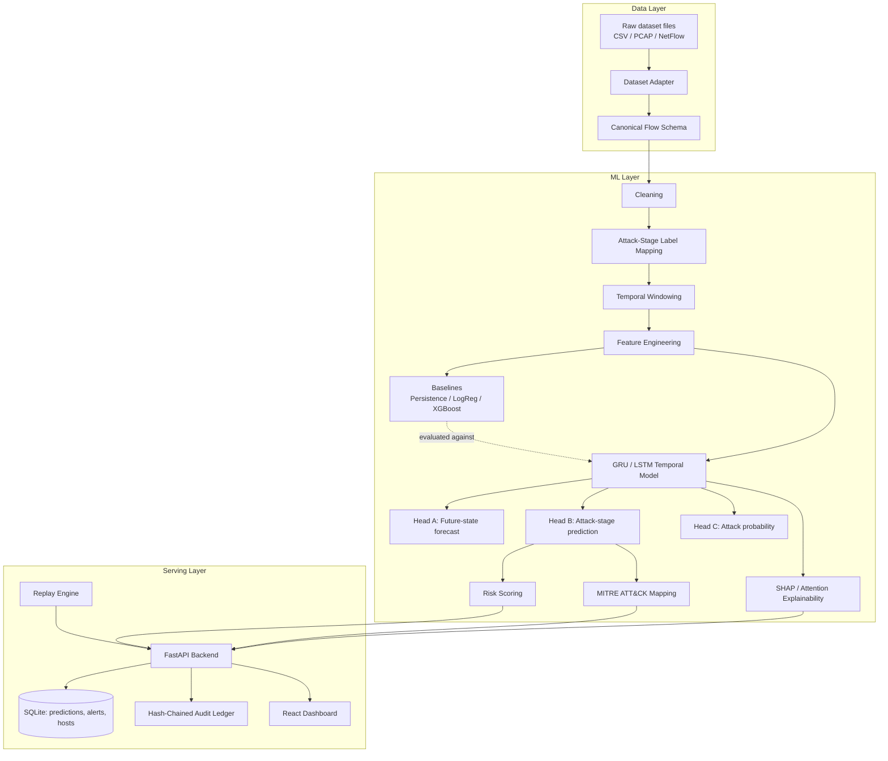

# AegisFlow — Architecture

SIH26153 · Team CyberVanguard (Team ID 40) · Theme: Blockchain & Cybersecurity

> **Current state vs this original plan.** This document is the original design. What is built: CIC-IDS2017 ingestion, host windows and sequences with a chronological split, a majority / logistic-regression / LSTM baseline (binary attack-next-window), a FastAPI backend with a replay engine, a SHA-256 hash-chained SQLite ledger, and a single-page vanilla-JS dashboard that polls the API, and per-prediction SHAP / Integrated Gradients explanations (`aegisflow explain`, `GET /explain/{sequence_id}`). **Not built:** React/TypeScript/Vite frontend, WebSocket updates, GRU/Transformer selection, future-state and attack-stage heads, attention, XGBoost, temporal GNN, additional dataset adapters. Phase table in §9 is out of date; everything through Phase 6-7 (in simplified form) exists. See `docs/model.md`, `docs/api.md`, `docs/demo.md` and `docs/codebase_walkthrough.md` for what actually runs.
> **Current state vs this original plan.** This document is the original design. What is built: CIC-IDS2017 ingestion, host windows and sequences with a chronological split, a majority / logistic-regression / LSTM baseline (binary attack-next-window), a FastAPI backend with a replay engine, a SHA-256 hash-chained SQLite ledger, and a single-page vanilla-JS dashboard that polls the API, and optional attention-LSTM / temporal Transformer models (`train --model`). **Not built:** React/TypeScript/Vite frontend, WebSocket updates, GRU, future-state and attack-stage heads, SHAP, XGBoost, temporal GNN, additional dataset adapters. Phase table in §9 is out of date; everything through Phase 6-7 (in simplified form) exists. See `docs/model.md`, `docs/api.md`, `docs/demo.md` and `docs/codebase_walkthrough.md` for what actually runs.

## 1. Component diagram

## 2. Data flow diagram

```mermaid
flowchart LR
    RAW[Raw CIC-IDS2017 CSVs] -->|adapter| CANON[Canonical DataFrame]
    CANON -->|clean| CLEAN[Cleaned DataFrame]
    CLEAN -->|stages.yaml mapping| LABELED[Labeled DataFrame]
    LABELED -->|parquet| INTERIM[(data/interim/*.parquet)]
    INTERIM -->|windowing, Phase 2| WINDOWS[(data/processed/*.parquet)]
    WINDOWS -->|train, Phase 3-4| MODEL[(models/*)]
    MODEL -->|inference, Phase 6| PRED[Predictions + Alerts]
    PRED -->|Phase 6| DB[(SQLite)]
    DB -->|Phase 7| DASH[Dashboard]
```

## 3. Repository structure

See the top-level tree in the project README. Phase 1 populates:
`aegisflow/config.py`, `aegisflow/schema.py`, `aegisflow/errors.py`,
`aegisflow/logging_setup.py`, `aegisflow/cli.py`,
`aegisflow/ml/datasets/*`, `aegisflow/ml/preprocessing/*`,
`aegisflow/ml/features/registry.py`, `aegisflow/ml/eda.py`,
`aegisflow/ml/ingestion/pipeline.py`, `configs/*.yaml`, `scripts/*`, `tests/*`.

`backend/`, `ml/models/`, `ml/training/`, `ml/explainability/`, `ml/mitre/`,
`ml/replay/`, and `frontend/` are created in later phases per the plan below.

## 4. Dataset strategy

- **Primary dataset (Phase 1): CIC-IDS2017**, `GeneratedLabelledFlows` variant.
  Chosen over CIC-IDS2018 for practicality: ~2.8M flows vs. tens of millions,
  downloadable as CSV without AWS S3 egress, and it retains IP/timestamp
  columns needed for per-host temporal windowing.
- **Secondary adapters (planned, Phase 9): UNSW-NB15, CTU-13, CIC-IDS2018** —
  for cross-dataset validation only, added after the CIC-IDS2017 pipeline is
  proven end to end.
- Every adapter implements the same `DatasetAdapter` interface
  (`aegisflow/ml/datasets/base.py`) and emits the same canonical schema
  (`aegisflow/schema.py`), so the rest of the pipeline (cleaning, windowing,
  modeling) is dataset-agnostic.
- **No dataset label directly encodes "attack stage".** `configs/stages.yaml`
  documents a proxy mapping from each dataset's own attack-name label to a
  normalized class and an inferred kill-chain stage, and ingestion refuses
  (raises `LabelMappingError`) to process any label that isn't explicitly
  mapped there.

## 5. Model strategy

Phase-by-phase, per the priority order in the project brief:

1. **Baselines** (Phase 3): majority-class, persistence (`next stage = current
   stage`), logistic regression, XGBoost — on single windows, no sequence.
2. **Temporal model** (Phase 4): GRU (default) / LSTM, configurable via
   `model.type`, consuming `(batch, sequence_length, feature_count)` windows.
   Three heads: future-state forecast (regression), attack-stage prediction
   (classification), attack probability (binary).
3. **Attention** (Phase 5): exposed per-window attention weights, surfaced via
   API so the dashboard can show "which past windows drove this prediction".
4. **Transformer** (Phase 5, optional): selectable via `model.type=transformer`,
   only after GRU/LSTM works and has a baseline comparison.
5. **Temporal GNN**: documented as future work (`docs/architecture.md` §7)
   unless a real per-host communication graph is built — never faked.

## 6. Training / evaluation strategy

- **Time-based split only** (`split.train_fraction` etc. in `config.yaml`):
  sorted by window end-time, earliest N% train, next M% val, remainder test.
  Never a random split — this is the single most important anti-leakage rule
  in the whole project (see project brief §21).
- Scalers/encoders are fit on the training split only and saved as artifacts.
- Metrics: per-class precision/recall/F1, macro-F1, weighted-F1, confusion
  matrix, false-positive rate, MAE/RMSE for future-state forecasting, and
  **forecast lead time** (mean/median/per-stage) — see `docs/model.md`
  (written in Phase 4) for the exact definitions from the project brief §20.
- All baselines and the temporal model are evaluated on the *same* held-out
  test split and reported in one table — no cherry-picking per model.

## 7. API architecture (Phase 6)

FastAPI, layered as `api/` (routers) → `services/` (business logic) →
`models/` + `schemas/` (SQLAlchemy + Pydantic) → `database/`. Endpoints match
the project brief §15 list exactly (health, dataset upload, pipeline
process, model train/status, metrics, hosts, alerts, predictions,
explanations, MITRE lookup, replay control, audit verify).

## 8. Dashboard architecture (Phase 7)

React + TypeScript + Vite, dark SOC-style UI (project brief §17–18): overview,
network timeline, attack-trajectory view, host risk table, alert detail
(with SHAP/attention/MITRE panels), forecast graph, replay controls, audit
log. Talks to the FastAPI backend over REST + a WebSocket for replay updates.

## 9. Development phases

| Phase | Scope | Status |
|---|---|---|
| 0 | Architecture + plan (this document) | done |
| 1 | Repo structure, config, CIC-IDS2017 adapter, ingestion, validation, EDA | **done — this delivery** |
| 2 | Feature engineering, temporal windowing, processed Parquet | next |
| 3 | Baseline models, training pipeline, evaluation | planned |
| 4 | GRU/LSTM temporal model, future-state forecasting, stage prediction | planned |
| 5 | Attention, SHAP, risk scoring, MITRE mapping | planned |
| 6 | FastAPI, database, replay engine, hash-chained audit log | planned |
| 7 | React dashboard | planned |
| 8 | Docker, tests, documentation, demo workflow | planned |
| 9 | Cross-dataset validation (UNSW-NB15 / CTU-13) if time allows | planned |

## 10. Honesty conventions used throughout

- `label_confidence` column: `"ground_truth"` (Benign only) vs `"inferred"`
  (every attack-stage mapping) — enforced by `configs/stages.yaml` and
  `aegisflow/ml/preprocessing/labels.py`.
- Optional canonical columns a dataset genuinely cannot supply (e.g.
  `ttl_mean` for CIC-IDS2017) are left as `NA`, never zero-filled or
  fabricated — see `aegisflow/ml/features/registry.py`.
- Any CLI command for a not-yet-built phase (`train`, `evaluate`, `replay`,
  `serve`) raises `NotImplementedPhaseError` with the phase it's planned for,
  rather than silently doing nothing or faking output.
